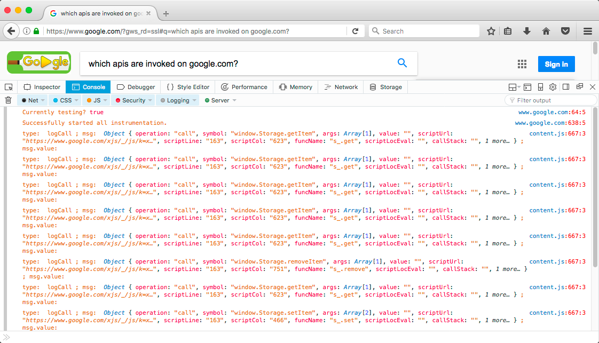

# data-leak



A [Browser Extension](https://developer.mozilla.org/en-US/Add-ons/WebExtensions)
to help detect potentially unsafe data leaving the browser. Including ...

- A webRequest listener version of [CLIQZ code](https://github.com/cliqz-oss/browser-core/blob/master/modules/antitracking/sources/attrack.es) for detecting potentially unsafe data leaving the browser.
- A content script version of [OpenWPM](https://github.com/citp/OpenWPM) and [Privacy Badger](https://github.com/EFForg/privacybadger) code for detecting which APIs are being used ... for fingerprinting.
- A browserAction for displaying all of the above.

This extension simply detects and logs network and API data - it does not store
anything in a database. If you need all that good stuff, you should really look
into OpenWPM - it's good people.

## Run it
```
cd data-leak
npm install
npm run build
```

In the Firefox browser that opens:

1. Open the Web Console tool
2. Navigate to any page
3. Observe the "Successfully started all instrumentation." line

You should also see lots of output in the format: `type: logCall ; msg:
<Object> ; msg.value: `

## Credits
* [CLIQZ](https://cliqz.com/)
* [OpenWPM](https://github.com/citp/OpenWPM)
* [Privacy Badger](https://www.eff.org/privacybadger)
* [Data Leak by Chameleon Design from the Noun Project](https://thenounproject.com/search/?q=data%20leak&i=796007)
